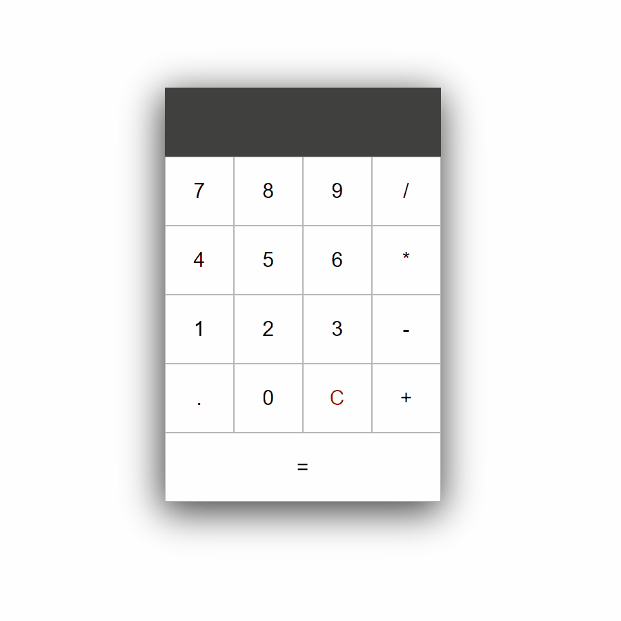

# Project: Calculator 
Make an on-screen calculator using JavaScript, HTML, and CSS.

https://www.theodinproject.com/courses/web-development-101/lessons/calculator

# Live Demo
https://nfordhk.github.io/calculator

# Features
* All operations supported (add, subtract, multiply, divide).
* Calculations performed using __order of operations__ or [BEDMAS](https://en.wikipedia.org/wiki/Order_of_operations#Mnemonics).
* Options include clearing the display and calculating the result.

## To Do
* Add input validation, to avoid errors or bugs (e.g 2++2, 12..1)

## Wishlist
* Implement keyboard entry (allow user to type variables and use enter key to evaluate).
* Add a backspace button, to undo if the wrong button is clicked.
